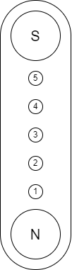

# ZSWatch Hardware

> [!NOTE]
> This is the release branch with tested PCB files. 
> For hardware development branch go to [ZSWatch-HW/tree/2.0.6_Dev](https://github.com/jakkra/ZSWatch-HW/tree/2.0.6_Dev). 
> For production files pick the [latest run here](https://github.com/jakkra/ZSWatch-HW/actions?query=event%3Apull_request_target) and scroll down to artifacts and pick `Watch` 
> Although tested, there may still be unknown issues not yet discovered and ordering ZSWatch PCBs are on your own risk.

## Table of Content

- [ZSWatch Hardware](#zswatch-hardware)
  - [Table of Contents](#table-of-contents)
  - [About](#about)
  - [Dock connector](#dock-connector)
  - [Directory structure](#directory-structure)
  - [Purchasing](#purchasing)
  - [Maintainer](#maintainer)

## About

Hardware repository for the [ZSWatch](https://github.com/jakkra/ZSWatch).

Please check the [wiki](https://github.com/jakkra/ZSWatch/wiki) for more information about the project.

## Dock connector

The pinout for the dock connector is shown below.

<table class="tg">
<thead>
  <tr>
    <th class="tg-0pky"></th>
    <th class="tg-0pky">Pin</th>
    <th class="tg-0pky">Description</th>
  </tr>
</thead>
<tbody>
  <tr>
    <td class="tg-0pky" rowspan="5"></td>
    <td class="tg-0pky">1</td>
    <td class="tg-0pky">VBUS (+5 V)</td>
  </tr>
  <tr>
    <td class="tg-0pky">2</td>
    <td class="tg-0pky">GND</td>
  </tr>
  <tr>
    <td class="tg-0pky">3</td>
    <td class="tg-0pky">SEL</td>
  </tr>
  <tr>
    <td class="tg-0lax">4</td>
    <td class="tg-0lax">D- / SWDIO</td>
  </tr>
  <tr>
    <td class="tg-0lax">5</td>
    <td class="tg-0lax">D+ / SWDCLK</td>
  </tr>
</tbody>
</table>

| SEL  | Function       |
|------|----------------|
|`LOW` | USB            |
|`HIGH`| SWD (Default)  |

## Directory structure

- `cad`: 3D model of the complete PCB
- `docs`: All kinds of project documentation like schematics, BOM, etc.
  - `drawings`: 2D drawings for subcomponents, etc.
  - `images`
- `project`: KiCad project for the PCB

## Purchasing

Please open `ZSWatch-navigate.html` and use the files listed under `purchasing` for ordering a PCB.

## Maintainer

- [Daniel Kampert](mailto:daniel.kameprt@kampis-elektroecke.de)
- [Jakob Krantz](mail@jakobkrantz.se)
